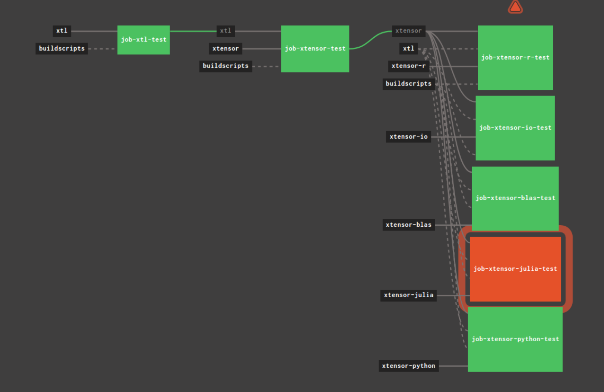
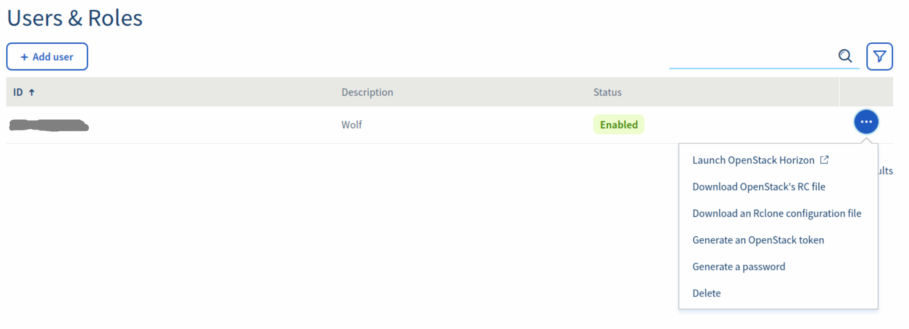

# xtensor continuous integration and benchmarking

This repository contains everything to set up a self-hosted, open source
continuous integration for xtensor and friends.
The setup is pretty generic, so it should be easy to replicate for other projects.
We're especially proud of the low-cost, open-source benchmarking solution
detailed below.

## Why use Concourse CI?

Thanks to Concourse CI we can not only test e.g. xtensor itself on every push to
master but also packages that use xtensor as a dependency. This allows us to
quickly notice when we unintentionally break backward compatibility and increases
our test coverage.
Also, for breaking releases, it lets us quickly see where we need to fix up
packages.



### Setup

The fastest way to get a Concourse instance running is with docker-compose.
Just follow the instructions from their repo at https://github.com/concourse/concourse-docker

One important change is to add

```yml
    logging:
      driver: "json-file"
      options:
        max-file: "5"
        max-size: "10m"
```

to each of the services in the docker compose file in order to prevent the logs
to grow without bounds. We found them quickly filling up the hard disk for
long-running processes (and this CI is supposed to be up for quite a while!).

-> opened a PR https://github.com/concourse/concourse-docker/pull/47

A good trick to get more information on the various configuration options is to
execute `docker run concourse/concourse web --help` (or `worker --help` for the
options of the worker).

To add a local user with an encrypted password, for example, the help section
tells us that we can use `bcrypt` to encrypt the password. On Linux, to encrypt
a password, use `htpasswd -bnBC 10 wolfv password` and copy the output
into the password field, e.g.:

```
CONCOURSE_ADD_LOCAL_USER: wolfv:$2y$10$5WOmUi5gwW1rbucFpIoFwOxqLRjMhCwxEm5QvXjQL2PF7E51.hDlW
```

I also needed to change the `CONCOURSE_EXTERNAL_URL` setting to the IP + port of
our server, so that logging in redirects to the correct URL.

Once concourse is up and running, you can download a small utility tool called
`fly` from the server. This tool is going to be installed locally and connects
to the Concourse server. With fly, you can control the CI pipeline and enable /
disable them.

It's probably the best to follow the concourse tutorial for the basic setup:

https://concoursetutorial.com/

If you didn't read it, `fly -t myproject login MYIP:PORT` is necessary as a first step, and
then `fly -t myproject sync` saves a config file to `~/.flyrc` so `fly -t myproject`
can just be used without the URL in the future.

We can then set up pipelines for the project. For our CI stack, we run
`fly -t myproject set-pipeline --pipeline xstack --config pipeline/pipeline.yml`

For the benchmark pipeline, we need to prepare a yml file that contains the necessary
secrets: OpenStack username and password, as well as a private SSH key to connect to
the OpenStack server. You find a template under `pipeline/empty_secrets.yml`

`fly -t myproject set-pipeline --pipeline xbench --config pipeline/benchmark_pipeline.yaml -l pipeline/secrets.yml`

The pipelines reference the tasks in the `tasks` folder. Each task contains a `script.sh`
which is the entry point from the `test.yml`. The `script.sh` is executed in the
docker container selected from the `test.yml` file.

For the benchmarks, the `script.sh` file runs in a docker container on the main
server but boots up a new OpenStack instance. It then copies the `bench_script.sh`
to the new OpenStack server and executes it there over ssh.

## Configuring OpenStack

In order to run benchmarks on a fresh OpenStack server, some configuration must
be set in the pipeline task. Check out the benchmark_pipeline.yml file.
The configuration variables can be extracted from the `openrc.sh` file that your provider should supply!

With OVH, you can find the button under -> Users -> Download OpenStack's RC file.



For the benchmark results, we also create an OpenStack Volume (10Gb is probably)
enough. It's easiest to create the volume from the GUI of the provider, and give
it a name there (we named it `benchresults` which you find referenced in the
`script.sh` file of the benchmark task).

Another important step is the creation of an ssh key for OpenStack:

The following installs the OpenStack tools, generates a new ssh key pair and adds
the key to OpenStack using the python toolkit:

```
sudo pip install python-openstackclient
source openrc.sh # need to source this to set configuration properly
ssh-keygen ... # save the keys somewhere you can find them again!
openstack keypair create ngkey --public-key ssh_key.pub # note that ngkey is the name
                                                        # we reference in the script.sh
```

## Cost of this setup

The costs depend on the type of machines you are using. We utilize the cheapest
OVH cloud machine to host Concourse, which runs on a shared CPU (called sandbox
instance) and cost 12.99 / month. You can find cheaper servers, e.g. with Hetzner
for 2.49 which will also work. For the benchmark machine, we will use OVH's c2-15
machine which costs roughly 17 cents an hour. If we use it 20 times a month for
1 hour, it will cost us about 3.40 Euro. This is still pretty cheap compared to
other CI services (which don't support dedicated benchmarking!). The volume to
store the benchmarks on costs 0.40 Euro/month.

## Further notes: debugging docker-compose

- Restarting Concourse is tricky, for some reason the Concourse worker doesn't
  always come up correctly. If it doesn't, one needs to `prune` the worker:

  - `fly -t myproject workers` -> find the worker in question
  - `fly -t myproject land-worker -w abcdefg` -> land the worker to stop it
  - `fly -t myproject prune-worker -w abcdefg` -> remove the worker
  - `docker-compose restart` to get the web server with worker running again

- Running out of space?
  - `docker system df` shows how much space is used and by what
  - `docker system prune --all --volumes` is the most radical way to free up space

